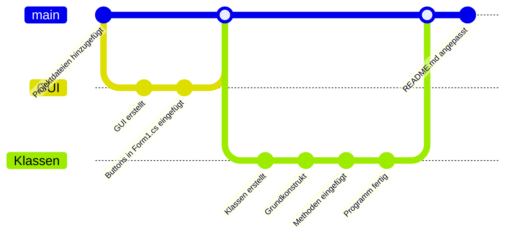
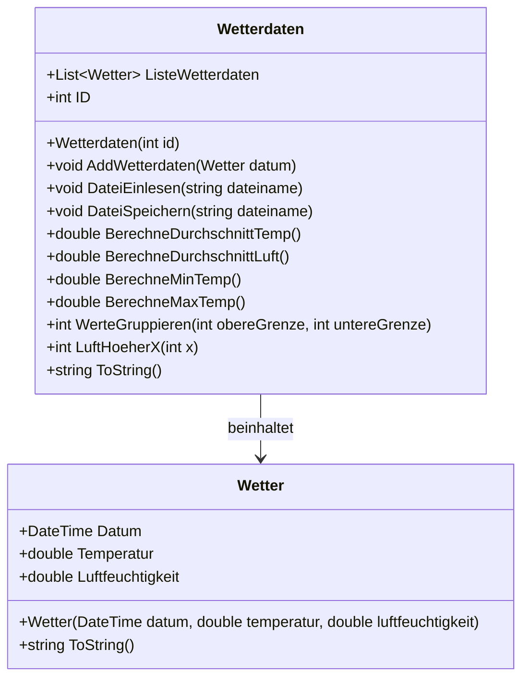

# Wetterdaten von Hendrik Hermes
## Aufgabe
Folgende Aufgaben sollen umgesetzt werden:
1. Erstellen Sie ein GUI mit Windows Forms.
2. Erstellen Sie eine Klasse Wetterdaten.
a. Zwei sinnvolle Konstruktoren
b. Properties
c. ToString() Methode
3. Die Datei „wetter.csv“ soll eingelesen werden und einer passenden Datenstruktur
abgespeichert werden (Liste , „Wetterdaten“).
4. Berechnung der durchschnittlichen Temperatur und Luftfeuchtigkeit der Werte in der
Datei.
5. Ermittlung der höchsten und niedrigsten Temperatur und Luftfeuchtigkeit.
6. Gruppierung der Messwerte nach Temperaturbereichen.
z.B. Temperaturbereich 0-10°C 5 Tage, 11-20°C 20 Tage, ...
7. Ausgabe der Tage, an denen die Luftfeuchtigkeit höher als 80% war.
8. Hinzufügen von neuen Wetterdaten (Datum, Temperatur, Luftfeuchtigkeit) und
Speichern der veränderten Daten in einer neuen Datei.
9. Ergänzen Sie die Klasse „Wetterdaten“: Die Temperatur kann nur Werte zwischen
-50°C und +50°C annehmen.
10.Fehlerhafte Eingaben der Daten sollen abgefangen werden.
## GUI

## Git-Graph

## Klassendiagramm

