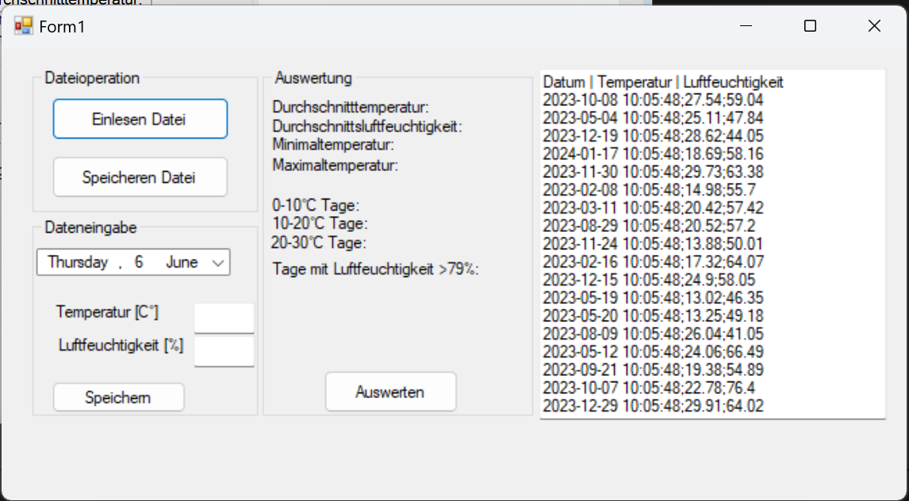
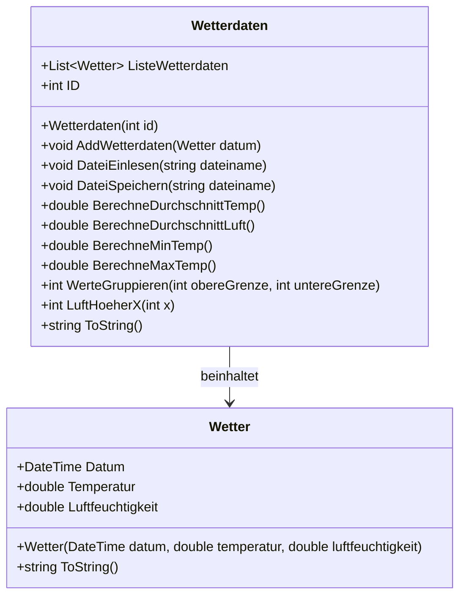

# Wetterdaten von Hendrik Hermes
## Funktion
- Einlesen und Abspeichern von .csv Dateien
- Manuelles Einfügen von Wetterdaten
- Auswerten der Wetterdaten
## GUI

## Git-Graph

```mermaid
gitGraph
commit id:"Projektdateien hinzugefügt"
branch GUI
commit id:"GUI erstellt"
commit id:"Buttons in Form1.cs eingefügt"
checkout main
merge GUI
branch Klassen
commit id:"Klassen erstellt"
commit id:"Grundkonstrukt"
commit id:"Methoden eingefügt"
commit id:"Programm fertig"
checkout main
merge Klassen
commit id:"README.md angepasst"
```
## Klassendiagramm

```mermaid
classDiagram
    Wetterdaten --> Wetter : beinhaltet
    class Wetterdaten{
        +List~Wetter~ ListeWetterdaten
        +int ID
        +Wetterdaten(int id)
        +void AddWetterdaten(Wetter datum)
        +void DateiEinlesen(string dateiname)
        +void DateiSpeichern(string dateiname)
        +double BerechneDurchschnittTemp()
        +double BerechneDurchschnittLuft()
        +double BerechneMinTemp()
        +double BerechneMaxTemp()
        +int WerteGruppieren(int obereGrenze, int untereGrenze)
        +int LuftHoeherX(int x)
        +string ToString()
    }
    class Wetter{
        +DateTime Datum
        +double Temperatur
        +double Luftfeuchtigkeit
        +Wetter(DateTime datum, double temperatur, double luftfeuchtigkeit)
        +string ToString()
    }
```
